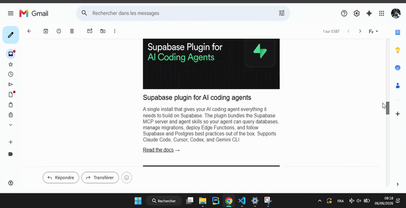

<div align="center">


# AbregeAi

**Résumez vos emails Gmail en un clic, directement depuis votre navigateur.**


*Extension Chrome open source — projet de portfolio.*

</div>

---

## 📋 Table des matières

- [À propos du projet](#-à-propos-du-projet)
- [Démonstration](#-démonstration)
- [Fonctionnalités](#-fonctionnalités)
- [Architecture](#️-architecture)
- [Installation](#-installation)
- [Configuration](#-configuration)
- [Utilisation](#-utilisation)
- [Sécurité et confidentialité](#-sécurité-et-confidentialité)
- [Contribuer](#-contribuer)
- [Licence](#-licence)

---

## 🎯 À propos du projet

**AbregeAi** est une extension Chrome qui s'intègre directement dans l'interface Gmail pour générer, en un clic, un résumé clair et concis de vos emails grâce au modèle d'intelligence artificielle **Gemini 2.5 Flash** de Google.

Le projet repose sur deux composants :

- **L'extension Chrome** (Manifest V3) — injectée dans Gmail, elle extrait le contenu textuel de l'email ouvert et l'envoie à un serveur proxy.
- **Le serveur proxy Node.js/Express** — déployé sur [Render](https://render.com), il reçoit le texte de l'extension, effectue l'appel à l'API Gemini de manière sécurisée (la clé API ne transite jamais dans le navigateur), puis retourne le résumé généré.

> Ce projet a été développé dans le cadre d'un portfolio de développeur. Il n'est pas affilié à Google.

---

## 🎬 Démonstration



---

## ✨ Fonctionnalités

- **Résumé en un clic** — cliquez sur « Abréger le mail ! » depuis la popup pour obtenir un résumé immédiat de l'email ouvert.
- **Extraction intelligente du texte** — le contenu de l'email est lu directement depuis le DOM de Gmail, sans permission d'accès à votre compte Google.
- **Proxy sécurisé** — la clé API Gemini n'est jamais exposée dans le navigateur ; tous les appels à l'API sont effectués côté serveur.
- **CORS restrictif** — le serveur n'accepte les requêtes qu'en provenance de l'extension légitime, bloquant tout accès direct non autorisé.
- **Résumé en français** — le modèle est instruit de fournir un résumé clair, structuré et en français, quel que soit la langue de l'email.
- **Interface minimaliste** — une popup légère de 320px, intégrée à Chrome, sans fenêtre supplémentaire.

---

## 🏗️ Architecture

```
┌─────────────────────────────────────┐
│           NAVIGATEUR (Chrome)       │
│                                     │
│  ┌──────────┐     ┌──────────────┐  │
│  │  Gmail   │────▶│  popup.js   │  │
│  │  (DOM)   │     │  + getText  │  │
│  └──────────┘     └──────┬───────┘  │
│                          │          │
└──────────────────────────┼──────────┘
                           │ POST /api/abrege
                           │ { text: "..." }
                           ▼
              ┌────────────────────────┐
              │   Serveur Express      │
              │   (Render — HTTPS)     │
              │                        │
              │  ✔ Vérification CORS   │
              │  ✔ Clé API sécurisée  │
              └───────────┬────────────┘
                          │
                          ▼
              ┌────────────────────────┐
              │   Google Gemini API    │
              │  gemini-2.5-flash      │
              └────────────────────────┘
```

**Stack technique :**

| Composant | Technologie |
|---|---|
| Extension | HTML, CSS, JavaScript (Manifest V3) |
| Serveur proxy | Node.js, Express 5 |
| Modèle IA | Google Gemini 2.5 Flash |
| Déploiement serveur | Render |
| Dépendances serveur | `express`, `cors`, `dotenv` |

---

## 📦 Installation

### Prérequis

- [Google Chrome](https://www.google.com/chrome/) (version 114 ou supérieure)
- [Node.js](https://nodejs.org/) v18+ (uniquement si vous hébergez votre propre serveur)
- Une clé API Google Gemini (voir section [Configuration](#-configuration))

---

### 1. Cloner le dépôt

```bash
git clone https://github.com/stanjosue-dev/abregeAi.git
cd abregeAi
```

---

### 2. Configurer et démarrer le serveur

> ⚠️ **Important — ID d'extension et CORS**
>
> Le serveur est configuré pour n'accepter les requêtes que depuis une extension Chrome avec un identifiant (ID) spécifique. Cet ID est généré automatiquement par Chrome lorsque vous chargez l'extension en mode développeur et **sera différent** de celui du serveur déployé par le propriétaire du dépôt.
>
> Vous devez donc **héberger votre propre instance du serveur** et y renseigner votre propre clé API ainsi que votre propre ID d'extension.

#### a) Installer les dépendances du serveur

```bash
cd server
npm install
```

#### b) Créer le fichier d'environnement

Créez un fichier `.env` dans le dossier `server/` :

```bash
# server/.env
API_KEY=VOTRE_CLÉ_API_GEMINI
PORT=3000
```

> Le fichier `.env` est listé dans `.gitignore` — il ne sera jamais publié sur GitHub. Ne le partagez jamais.

#### c) Démarrer le serveur en local

```bash
npm start
# → Serveur démarré sur le port : 3000
```

---

### 3. Récupérer l'ID de votre extension Chrome

Avant de charger l'extension, vous devez connaître son futur ID pour le configurer dans le serveur.

**La méthode la plus fiable :** chargez d'abord l'extension (étape 4), puis relevez son ID depuis `chrome://extensions/`, et mettez-le à jour dans `server/app.js` :

```js
// server/app.js
const allowedOrigins = [
    'chrome-extension://VOTRE_ID_EXTENSION_ICI'
];
```

Redémarrez le serveur après modification.

---

### 4. Mettre à jour l'URL du serveur dans l'extension

Dans `popup.js`, remplacez l'URL par celle de votre serveur (local ou déployé) :

```js
// popup.js — ligne du fetch
fetch('http://localhost:3000/api/abrege', param)
// Remplacez par votre URL Render si vous déployez en ligne :
// fetch('https://votre-serveur.onrender.com/api/abrege', param)
```

Et dans `manifest.json`, mettez à jour `host_permissions` en conséquence :

```json
"host_permissions": [
    "http://localhost:3000/*"
]
// ou pour Render :
// "https://votre-serveur.onrender.com/*"
```

---

### 5. Charger l'extension dans Chrome (mode développeur)

1. Ouvrez Chrome et naviguez vers `chrome://extensions/`
2. Activez le **Mode développeur** (bouton en haut à droite)
3. Cliquez sur **« Charger l'extension non empaquetée »**
4. Sélectionnez le dossier racine du projet (`abregeAi/`, celui qui contient `manifest.json`)
5. L'extension apparaît dans la liste avec son icône 🧠

> L'extension est maintenant installée. Relevez son ID affiché sous son nom et assurez-vous qu'il correspond bien à celui configuré dans `server/app.js`.

---

## ⚙️ Configuration

### Obtenir une clé API Google Gemini (gratuit)

1. Rendez-vous sur [Google AI Studio](https://aistudio.google.com/app/apikey)
2. Cliquez sur **« Create API key »**
3. Collez-la dans votre fichier `server/.env` : `API_KEY=votre_clé_ici`

> L'API Gemini propose un niveau gratuit généreux. Aucune carte bancaire n'est requise pour démarrer.

---

### Options de déploiement du serveur

Selon vos besoins, plusieurs configurations sont possibles :

| Scénario | Description | Recommandé pour |
|---|---|---|
| **Serveur local** | `npm start` dans `server/`, fetch vers `localhost:3000` | Usage personnel, développement |
| **Serveur distant (Render)** | Déployez `server/` sur [Render](https://render.com) (gratuit), fetch vers l'URL fournie | Partage avec d'autres utilisateurs |
| **Clé côté frontend** *(non recommandé)* | Supprimez le serveur et appelez Gemini directement depuis `popup.js` | Usage strictement personnel, sans partage du code |

> ⚠️ **Avertissement sur l'option « clé côté frontend »** : intégrer la clé API directement dans `popup.js` expose celle-ci à quiconque inspecte le code de l'extension. Ne faites cela que pour un usage 100% personnel sans partage pour votre cas si vous clonez mon repo.
---

## 🚀 Utilisation

Une fois l'extension installée et le serveur démarré, voici comment l'utiliser :

**1.** Ouvrez [Gmail](https://mail.google.com) dans Chrome.

**2.** Ouvrez un email de votre choix en cliquant dessus.

**3.** Cliquez sur l'icône 🧠 **AbregeAi** dans la barre d'outils de Chrome (en haut à droite du navigateur).

> Si l'icône n'est pas visible, cliquez sur l'icône puzzle 🧩 pour afficher toutes les extensions et épinglez AbregeAi.

**4.** Dans la popup qui s'ouvre, cliquez sur le bouton **« Abréger le mail ! »**.

**5.** Patientez quelques secondes — le message *« Résumer en cours... »* s'affiche pendant le traitement.

**6.** Le résumé généré par Gemini apparaît directement dans la popup.

> **Note :** l'extension lit l'email **actuellement affiché** dans Gmail. Si aucun email n'est ouvert, le message *« Aucun mail à résumer ici »* s'affichera.

---

## 🔒 Sécurité et confidentialité

### Ce que l'extension fait

- ✅ Lit le contenu textuel de l'email **actuellement ouvert**, uniquement lorsque vous cliquez sur le bouton
- ✅ Envoie ce texte au serveur proxy via HTTPS pour traitement
- ✅ Affiche le résumé retourné par l'API Gemini

### Ce que l'extension ne fait pas

- ❌ N'accède pas à votre compte Google ou à vos identifiants
- ❌ Ne stocke aucune donnée (aucun cache, aucune base de données)
- ❌ Ne collecte aucune métadonnée (expéditeur, destinataires, objet, date)
- ❌ N'utilise aucun tracker, analytics ou cookie
- ❌ Ne modifie, n'envoie ni ne supprime d'emails

### Responsabilité de la clé API

> **Chaque utilisateur est responsable de sa propre clé API Gemini.**

Si vous déployez votre propre instance du serveur :
- Votre clé API est stockée dans les variables d'environnement de votre serveur ( comme dans le repo actuelle ) — elle n'est jamais exposée dans le code source publié.
- Vous êtes responsable des appels effectués avec votre clé et des éventuels dépassements de quotas.

### Données transmises à Google Gemini

Le texte de l'email est envoyé à l'API Gemini (Google) pour génération du résumé. Ce traitement est régi par les [conditions d'utilisation de l'API Gemini](https://ai.google.dev/gemini-api/terms) et la [politique de confidentialité de Google](https://policies.google.com/privacy).

### Protection CORS côté serveur

Le serveur Express vérifie l'origine de chaque requête. Seule l'extension Chrome avec l'ID configuré est autorisée à appeler l'API. Toute requête directe (curl, Postman, navigateur) est rejetée avec une erreur `403 Forbidden`.

---

## 🤝 Contribuer

Les contributions sont plus que les bienvenues ! Voici comment participer :

```bash
# 1. Forker le dépôt sur GitHub

# 2. Créer une branche pour votre fonctionnalité
git checkout -b feature/nom-de-la-fonctionnalite

# 3. Effectuer vos modifications et les committer
git commit -m "feat: description claire de la modification"

# 4. Pousser la branche
git push origin feature/nom-de-la-fonctionnalite

# 5. Ouvrir une Pull Request sur GitHub
```

### Axes d'amélioration envisageables...

- [ ] Mise en cache des résumés pour éviter les appels API répétés sur un même email
- [ ] Gestion du streaming (affichage progressif du résumé)
- [ ] Support des fils de discussion imbriqués (plusieurs emails)
- [ ] Indicateur visuel de chargement amélioré
- [ ] Mise à jour automatique du sélecteur DOM si Gmail est mis à jour
- [ ] Tests unitaires pour le serveur proxy

---

## 📄 Licence

Distribué sous licence **MIT**. Voir le fichier [LICENSE](LICENSE) pour plus d'informations.

---

<div align="center">

❤️ — projet open source de portfolio

*Non affilié à Google.*

</div>